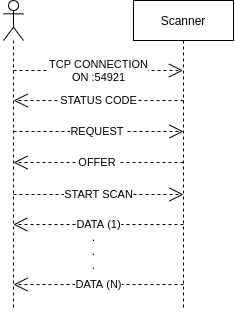

# Brother MFC-7820N WiFi scanner protocol

## Reasons

_Brother MFC-7820N already has a scanner driver you can download [here](https://support.brother.com/g/b/downloadtop.aspx?c=it&lang=it&prod=mfc7820n_all)_ **but that are prebuilt binary (x86/x64) and source code isn't public**. This is a problem if you want to use the scanner on ARM architecture, because if you don't have the source code of the driver you can't recompile it. Anyway this should work on every scanner that use `brscan2`, but I'm not sure.

## Scanning protocol




### Status codes

When we open a connection with the scanner on port 54921, it respond with his status code:

- `+OK 200`: Ready to use
- `-NG 401`: Scanner is busy

### Lease

Now we can send a request that specify resolution and color mode, then scanner send to client a offer based on request.
I called this part `lease because it recalled me _DHCP lease_

#### REQUEST

```go
request := []byte(fmt.Sprintf("\x1bI\nR=%d,%d\nM=%s\n\x80", resolution, resolution, mode))
sendPacket(socket, request)
```

#### RESPONSE

`300,300,2,209,2480,294,3472`

- `response[2]` : ADF status

##### (X,Y)

- `response[0]` `response[1]`: Image DPI
- `response[3]` `response[5]`: Plane dimensions in _mm_
- `response[4]` `response[6]`: Image resolution in _px_

##### COLOR MODES

- **GRAY64**: gray scale image
- **CGRAY**: color image
- **TEXT**: low resolution mode, 1 bps

##### RESOLUTIONS

- 100x100
- 150x150
- 200x200
- 300x300
- 600x600
- 1200x1200 **untested**
- 1200x2400 **untested**

## Start scan

Now we are ready to send start scan request:

```go
width = mmToPixels(planeWidth, dpiX)
height = mmToPixels(planeHeight, dpiY)

requestFormat := "\x1bX\nR=%v,%v\nM=%s\nC=%s\nJ=MID\nB=50\nN=50\nA=0,0,%d,%d\n\x80"
request = []byte(fmt.Sprintf(requestFormat, dpiX, dpiY, mode, compression, width, height))
```

- **R** = `X_DPI`, `Y_DPI`
- **M** = `CGRAY`, `GRAY64`, `TEXT`
- **C** = `JPEG` or `RLENGTH` or `NONE` **JPEG/RLENGTH UNTESTED**
- **D** = SIN
- **B** = 50 (Brightness?)
- **N** = 50 (Contrast?)
- **A** = 0,0,`WIDTH`, `HEIGHT`

## Compile

```bash
git clone https://github.com/corsmith/mfc-7820n.git
go build -o mfc-7820n mfc-7820n/src/*.go
```

## Usage

```bash
./mfc-7820n --help
```

Output:

```bash
Usage of ./mfc-7820n:
  -a string
        IP address of the Brother scanner (default "192.168.0.157")
  -c string
        Color mode of the scan (CGRAY, GRAY64, TEXT) (default "CGRAY")
  -m    Enable scan of all pages from feeder
  -n string
        Name of the output file (default "scan.tiff")
  -r int
        Resolution of the scan (default 300)
  -i string
	Name of the raw input file to parse instead of connecting to the printer
```

## To do

- [ ] Implement multi page scan for ADF
- [ ] Implement CGRAY decoding
- [ ] Implement GRAY64 decoding

## Credits

[Corey Smith](https://github.com/corsmith)
[Andrea Maugeri](https://github.com/v0lp3)

Partially thanks to [this](https://github.com/davidar/mfc7400c/)
